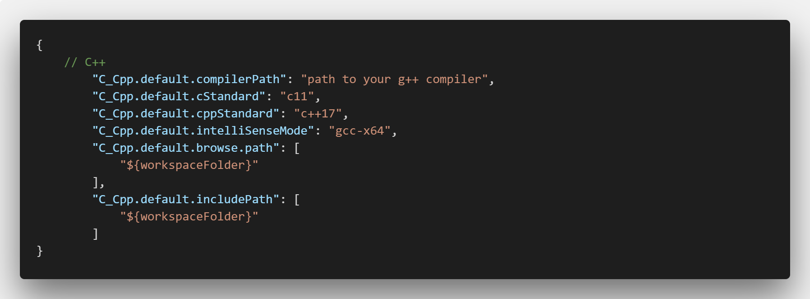
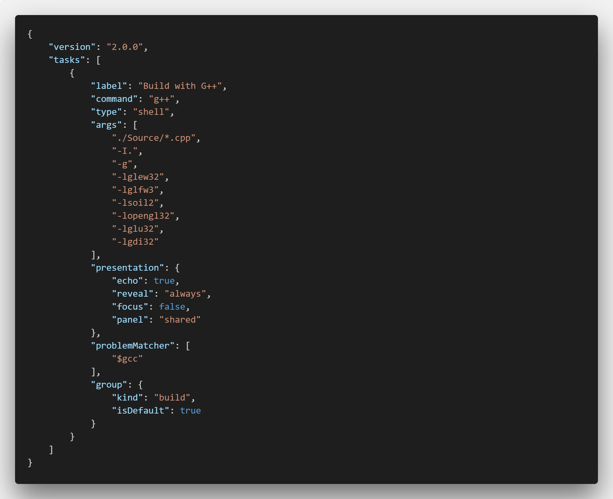
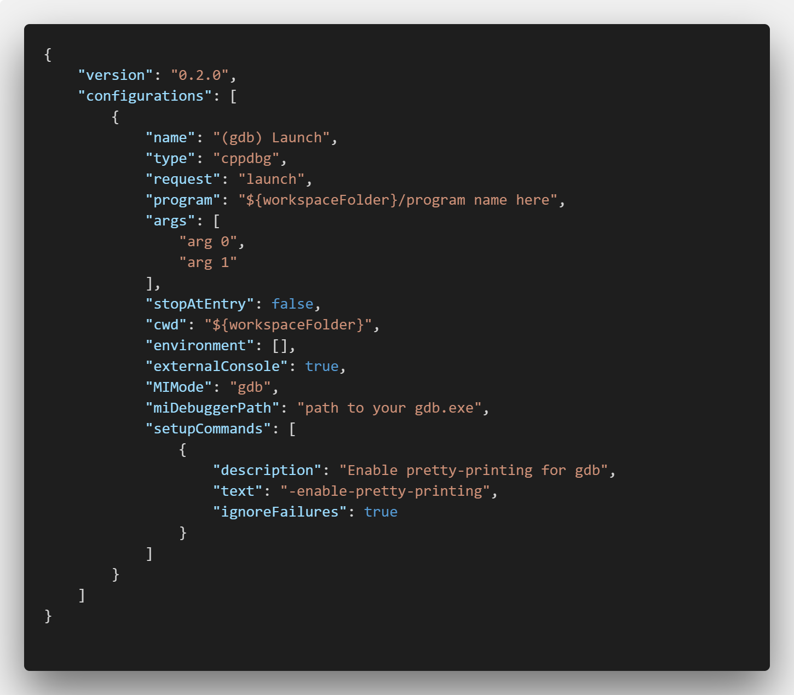

# OpenGL C++ development using VS Code and GCC

In this repository, I share some of my knowledge regarding a completely IDE-free C++ software development environment, as well as useful libraries and tools regarding OpenGL C++ applications.

This "guide" (wouldn't actually call it a guide) was elaborated focusing on Microsoft Windows ecosystem, but one wouldn't expect many differences when setting the environment on both macOS or Linux-based OSes. Should even be easier.

## Software you'll need

### Visual Studio Code

First things first. To edit code you need a... well, editor. And Visual Studio Code is THE ONE.

You can get it right [here](https://code.visualstudio.com/).

### C/C++ Extension

Visual Studio Code has a lot of useful extensions to suit your code needs. The one that'll be particularly important for us is the C/C++ one.

The C/C++ VS Code extension brings IntelliSense capabilities to your C or C++ code, meaning you'll get nice autocomplete insights based on already written code AND also will allow you to communicate the current C and C++ files to your installed compiler.

You can grab the extension by going to [this link](https://marketplace.visualstudio.com/items?itemName=ms-vscode.cpptools) and selecting "Install" (duh).

### GNU Compiler Collection

The GCC - or as the above title states, GNU Compiler Collection - is a set of compilers for a variety of languages that I will not list here. What matters for us is that among these languages are C and C++.

Using my beloved [Scoop command-line installer](https://scoop.sh), you can just type:
    
    scoop install gcc

Same if you're on macOS using it's awesome homebrew:

    brew install gcc

Or you're a pro-Linux user with apt:

    sudo apt install build-essential

If you're not a CLI fan, head over to [GCC Project's official website](https://www.gnu.org/software/gcc/) and grab the latest installer.

## Setting up

After installing all of the softwares listed above, you'll need to arrange your development environment.

We must allow VS Code and it's extension we installed to find the appropriate compiler for our C or C++ code. To do so, go to Code settings by `File` > `Preferences` > `Settings` or use following keyboard shortcuts:

| Operating System | Shortcut                                 |
|------------------|------------------------------------------|
| Windows, Linux   | <kbd> Ctrl       </kbd> + <kbd> , </kbd> |
| macOS            | <kbd> ⌘ Command </kbd> + <kbd> , </kbd> |

If you're presented with the GUI settings editor, opt for the JSON view by clicking on the `...` icon on top right corner.

Now, include the following items on your `settings.json` file:

Don't forget to add the compiler path, pointing to your g++.exe! Here's an example of how it's set on my PC:
`"C:\Users\bruno\scoop\apps\gcc\current\bin\g++.exe"`

On macOS, it's usually under `"usr/local/bin"`, but you can find it using the `which` command (if it's in your PATH):

    which g++

Now, Code knows exactly where to find your compiler and is able to give you code feedback, such as error squiggles or definition viewing.

## Creating projects

When using Visual Studio or other full-featured IDEs, you'll find your project full of specific files that store project settings, include options, build info and so on. Those files are in most cases not so portable.

The whole point of using a lightweight code editor like VS Code is to give the developer flexibility and control over every file of his/her projects. So you have basically none structural standard to follow. Just throw your files anywhere in the project folder, mix up `.cpp` and `.h` files, whatever suits you ;)

There are, however, some helpful automation you can do using Code's tasks.

Tasks on VS Code are JSON files that can help you set up a build script or debugging for your project, for example. They're project specific, so you can create them on every project you start using this environment. Here are the ones I use:

### Build Task

This is the most important task on my projects.

When you start using a lot of third-party libraries and linking them on build, it gets extremely painful to type the same command each time you want to test the app. In my case, the build command was:

    g++ -Wall ./Source/*.cpp -I. -g -lglew32 -lglfw3 -lsoil2 -lopengl32 -lglu32 -lgdi32

See what painful typing meant?

So, to set this up as a build task on Code, create a `.vscode` folder on your workspace root folder and a new file in it, called `tasks.json`. Here is the task for the above command:

So now, whenever you want to build your project, just go to `Terminal` > `Run Build Task` menu option or use the following shortcuts:

| Operating System | Shortcut                                                      |
|------------------|---------------------------------------------------------------|
| Windows, Linux   | <kbd> Ctrl  </kbd> + <kbd> Shift      </kbd> + <kbd> B </kbd> |
| macOS            | <kbd> Shift </kbd> + <kbd> ⌘ Command </kbd> + <kbd> B </kbd> |

### Launch Task

Launch tasks provide an easy way to start your app or start it with debugging, providing same ways of customizing arguments and command options compared to the build task.

Here's an example of my build task, allowing me to debug code by having the path to the GDB (GNU Debugger):

When you want to launch your compiled application, you can just go to `Debug` > `Start Without Debugging` / `Start Debugging` or use the shortcuts:

| Operating System | Shortcut (Start Without Debugging)        |
|------------------|-------------------------------------------|
| Windows, Linux   | <kbd> Ctrl       </kbd> + <kbd> F5 </kbd> |
| macOS            | <kbd> ⌘ Command </kbd> + <kbd> F5 </kbd> |

`Start Debugging` shortcut is F5.
